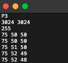
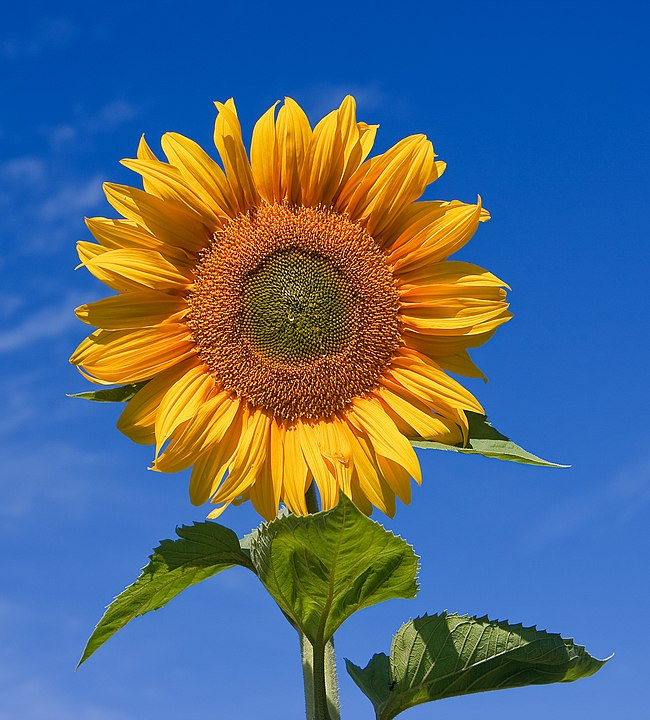
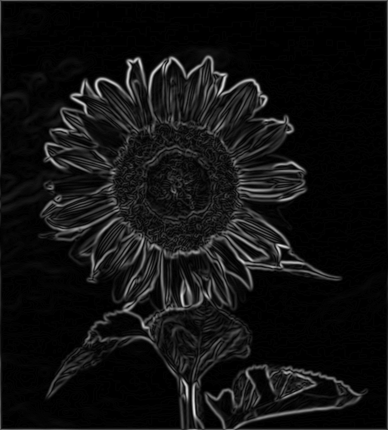
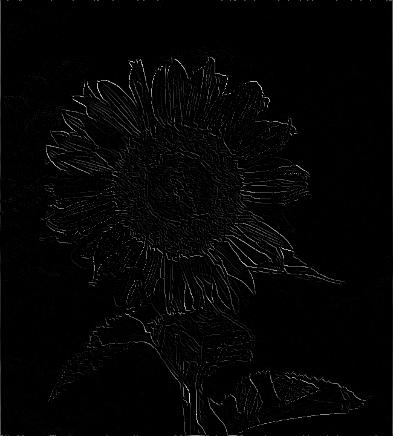
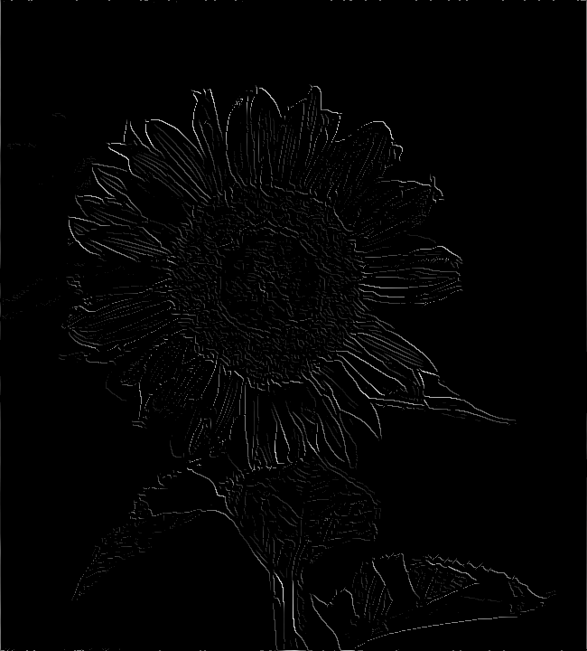
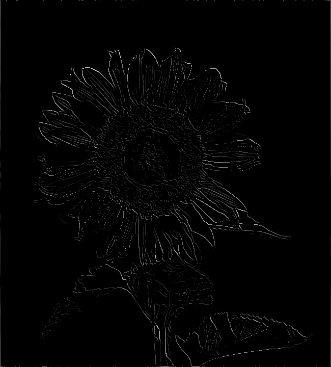
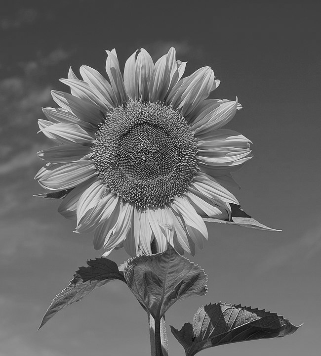

# PPM Photo editor

The primary objective of this project is to create a set of classes able to perform essential
image editing such as kernel image processing. This project will also serve as a 101 course for me to understanding 
image processing algorithms and developing skills in software development, particularly in handling graphical data.

## Restrictions on Image format

When choosing the input image be sure to use images that are in PPM or PGM format (P3 or P2), strictly in ASCII layout 
(https://en.wikipedia.org/wiki/Netpbm). The .ppm/.pgm file from a text editor must look like the this. 
It doesn't matter whether the pixels are ordered in a list or in rows of RGB/gray scale value.

To satisfy these particular requests use an editor like GIMP to export the file in the right format, then open the
.ppm/.pgm file in a text editor and delete the watermark that GIMP included in exported files. Now you are good to go.

## Right now you can use:

### Gaussian Blur:
In practice, Gaussian blur calculates a weighted average of the pixel values around each pixel in the image, replacing 
the original pixel value with this weighted average. This process smooths out the intensity variations between neighboring 
pixels, making the overall image smoother and less detailed.
The intensity of the blur can be regulated through the σ value given as a parameter during the constructor call, where σ 
is the standard deviation, which determines the spread of the Gaussian distribution. The higher the value the more intense 
the blurring. Following the result with σ = 0, σ = 3, σ = 7 and σ = 14.

    
    
    
    

### Edge Detection:
This filter is base on the famous and used Canny Edge Detection algorithm. Through the interpretation and manipulation of 
the image's gradient the algorithm is able to find the edges of the objects in the image. The implementation is based on 
the documentation that you can find at the following wikipedia link (https://en.wikipedia.org/wiki/Canny_edge_detector). 
In brief:

1. Noise Reduction: Apply a Gaussian filter to smooth the image.
2. Gradient Calculation: Compute the gradient magnitude and direction using the Sobel operator.
3. Non-Maximum Suppression: Thin the edges by keeping only local maxima.
4. Double Thresholding: Classify pixels into strong, weak, and non-edges based on two thresholds.
5. Edge Tracking by Hysteresis: Finalize the edge map by promoting weak edges connected to strong edges.

Following the output of every step:

    
    
    
    
    

### Conversion From RGB to Gray Scale (from .ppm to .pgm)
Is possible to convert an RGB image in a single gray scale channel image using the given method in the Image class. 
Put as parameter the new .pgm file path that you want to create, the method will convert the RGB value in a single 
gray scale value with the use of a weighted average between the channels. Is necessary to use a weighted average of the 
RGB channels because the human brain reacts differently to RGB. Eyes are most sensitive to green light, less sensitive to 
red light, and the least sensitive to blue light. Is also possible to convert a gray scale image to an RGB image using the 
constructor. 

    
    

## Sources
A big part of the math applied in the implementation of the image processing features is based on the lectures of the
"First Principles of Computer Vision" course of the Columbia University (https://fpcv.cs.columbia.edu/Monographs) and on
the related pages that you can find on wikipedia.
